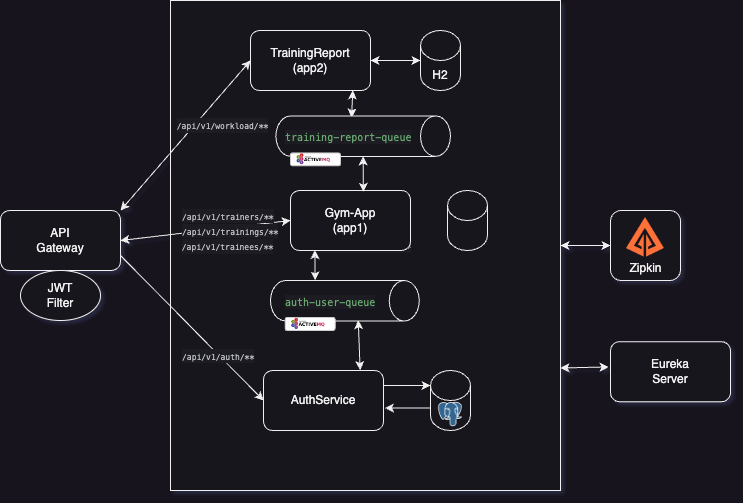

# Gym Microservices Architecture

## Overview
The Gym Microservices Architecture is a robust and scalable system designed to streamline gym operations. This project uses cutting-edge microservices architecture to manage trainers, trainees, and training sessions while ensuring security, fault tolerance, and performance. Key highlights include:

- **Asynchronous Messaging**: Services communicate through message queues for better decoupling.
- **Service Discovery**: Eureka server dynamically discovers and registers services.
- **Secure Access**: Role-based access control using JWT tokens.
- **Tracing and Monitoring**: Zipkin integration provides insights into request flow across services.
- **Databases**: PostgreSQL for persistent user data and H2 for in-memory reporting data.

## Services

### 1. **API Gateway**
- Acts as the entry point for all client requests.
- Routes requests to corresponding services based on paths.
- Secures endpoints using JWT-based authentication.

### 2. **Gym-App (app1)**
- Core service managing trainees, trainers, and training sessions.
- Publishes messages to the following queues:
    - **auth-user-queue**: Sends user-related actions to the AuthService.
    - **training-report-queue**: Sends training-related updates to the TrainingReport service.

### 3. **AuthService**
- Handles user authentication and authorization.
- Manages user data and roles.
- Uses PostgreSQL for persistent storage.
- Processes messages from `auth-user-queue`.

### 4. **TrainingReport (app2)**
- Tracks and calculates training hours for trainers and trainees.
- Stores reports in an H2 in-memory database.
- Processes messages from `training-report-queue`.

## Communication and Architecture
- **Messaging Queues**: Communication between services is handled via **ActiveMQ**:
    - `auth-user-queue`: For interactions between Gym-App and AuthService.
    - `training-report-queue`: For interactions between Gym-App and TrainingReport.
- **Eureka Server**: Provides dynamic service discovery and registration.
- **Tracing**: Integrated **Zipkin** to trace requests across services for debugging and performance optimization.
- **JWT Security**: Secures endpoints with role-based access controls.

## Architecture Diagram
The system architecture is illustrated below:



## Features
- Modular and scalable design for independent service deployment.
- Decoupled communication for better reliability and resilience.
- Secure, role-based access using JWT tokens.
- Real-time tracing for monitoring and troubleshooting.

---

## Getting Started
1. Clone the repository:
   ```bash
   git clone https://github.com/your-repo-url.git
   cd gym-microservices
   ```
   
2. Configure services:
    - Update `application.properties` files in each service with the correct database and ActiveMQ configurations etc.
3. Start the services:
    ```bash
    cd eureka-server/gym-app/auth-service/training-report/api-gateway
    mvn spring-boot:run
   ```
## Contributing
Contributions are welcome! Feel free to fork the repository, submit pull requests, and open issues.